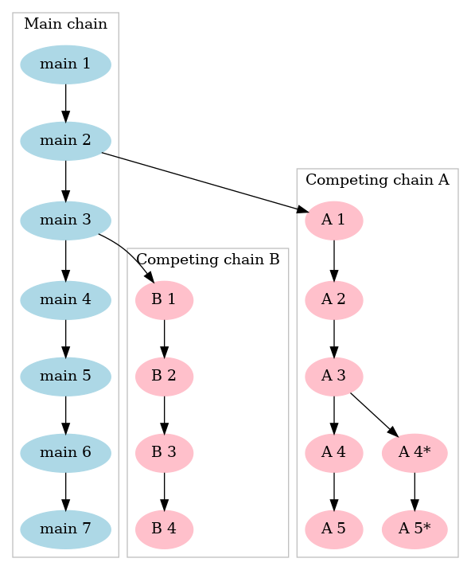
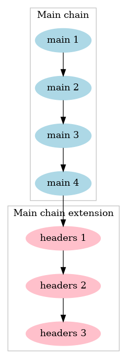
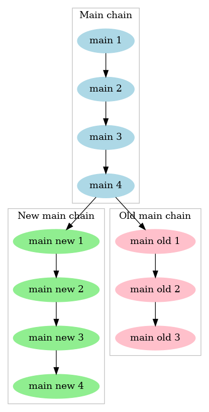

Webhook Notification Messages
=============================

Double-spends
-------------
The SV node will use webhooks to notify listeners that new double-spends have been detected on alternate chains on the blockchain. The recipient of the webhook message can be configured using the new command line parameter, *dsdetectedwebhookurl*.

The DSD notification message template is shown below:

```
{
    "version" : number,
    "blocks : [
        {
 
            "divergentBlockHash" : string,
            "headers" : [
                {
                    "version" : number,
                    "hashPrevBlock" : string,
                    "hashMerkleRoot" : string,
                    "time" : number,
                    "bits" : number,
                    "nonce" : number
                }
            ],
            "merkleProof" : {
                "index" : number,
                "txOrId" : string,    // Full transaction, serialised, hex-encoded
                "targetType": "merkleRoot",
                "target" : string,    // Merkle-root
                "nodes" : [ "hash", ... ]
            }
        },
        ...
    ]
}
```

Safe Mode
---------
The node will use webhooks to notify listeners that node has gone into safe-
mode. The recipient of the webhook message can be configured using the new
command line parameter, *safemodewebhookurl*.  The safe-mode notification
message template is shown below.

```
{
    "safemodeenabled": boolean,           // Is the node in the safe mode.
    "activetip": {                        // Tip of the main chain.
        "hash": string,                   // Block hash.
        "height": number,                 // Block height.
        "blocktime": string,              // Human readable, UTC, block time.
        "firstseentime": string,          // Human readable, UTC, time when the node first received header.
        "status": "active"                // Status of the block. Possible values: active, invalid
                                          //     headers-only, valid-fork, and valid-headers.
    },
    "timeutc": string,                    // Human readable, UTC, time of creation of this message.
    "reorg": {                            // Information about possible reorg.
        "happened": bool,                 // Indicates if an reorg happened.
        "numberofdisconnectedblocks": number, // Number of blocks disconnected in reorg.
        "oldtip": {                       // Information about old active tip, "null" if an reorg did not happened.
            "hash": string,               
            "height": number,
            "blocktime": string,
            "firstseentime": string,
            "status": string
        }
    },
    "forks": [                             // List of forks that are triggering the safe mode.
        {
            "forkfirstblock": {            // Root of the fork, this block's parent is on the main chain.
                "hash": string,
                "height": number,
                "blocktime": string,
                "firstseentime": string,
                "status": string
            },
            "tips": [                      // List of tips of this fork.
                {
                    "hash": string,
                    "height": number,
                    "blocktime": string,
                    "firstseentime": string,
                    "status": string
                },
                ...
            ],
            "lastcommonblock": {            // Block on the main chain which is parent of the "forkfirstblock"
                "hash": string,
                "height": number,
                "blocktime": string,
                "firstseentime": string,
                "status": string
            },
            "activechainfirstblock": {      // Block on the main chain which is child of the "lastcommonblock"
                "hash": string,
                "height": number,
                "blocktime": string,
                "firstseentime": string,
                "status": string
            },
        },
    ...
    ]
}
```

### Example 1
Here is an example of complex blockchain situation. Here we have two forkings and one of them has multiple tips.



Resulting JSON:

```
{
    "safemodeenabled": true,
    "activetip": {
        "hash": "main 7",
        ...
    },
    ...
    "reorg": {
        "happened": false,
        "numberofdisconnectedblocks": 0,
        "oldtip": none
    },
    "forks": [
        {
            "forkfirstblock": {
                "hash": "A 1", 
                ...
            },
            "tips": [
                {
                    "hash": "A 5", 
                    ...
                },
                {
                    "hash": "A 5*", 
                    ...
                }
            ],
            "lastcommonblock": {
                "hash": "main 2", 
                ...
            },
            "activechainfirstblock": {
                "hash": "main 3", 
                ...
            },
        },
        {
            "forkfirstblock": {
                "hash": "B 1"", 
                ...
            },
            "tips": [
                {
                    "hash": "B 4", 
                    ...
                },
            ],
            "lastcommonblock": {
                "hash": "main 3", 
                ...
            },
            "activechainfirstblock": {
                "hash": "main 4", 
                ...
            },
        }
    ]
}
```
### Example 2

Here we have most common situation which could trigger the safe mode. A node receives a number of headers but did not get blocks yet.

Note that if the fork extends active tip `"activechainfirstblock"`is `null`. And `"lastcommonblock"` is same as `"activetip"`.



Resulting JSON:

```
{
    "safemodeenabled": true,
    "activetip": {
        "hash": "main 4",
        ...
    },
    ...
    "reorg": {
        "happened": false,
        "numberofdisconnectedblocks": 0,
        "oldtip": none
    },
    "forks": [
        {
            "forkfirstblock": {
                "hash": "headers 1", 
                ...
            },
            "tips": [
                {
                    "hash": "headers 3", 
                    ...
                }
            ],
            "lastcommonblock": {
                "hash": "main 4", 
                ...
            },
            "activechainfirstblock": none
        }
    ]
}
```
### Example 3

An reorg happen with old branch **safemodeminforklength** long or longer (default is 3 blocks) . Active chain tip changed from "main old 3" to "main new 4".



Resulting JSON:

```
{
    "safemodeenabled": true,
    "activetip": {
        "hash": "main new 4",
        ...
    },
    ...
    "reorg": {
        "happened": true,
        "numberofdisconnectedblocks": 3,
        "oldtip": {
            "hash": "main old 3", 
        }
    },
    "forks": [
        {
            "forkfirstblock": {
                "hash": "main old 1", 
                ...
            },
            "tips": [
                {
                    "hash": "main old 3", 
                    ...
                }
            ],
            "lastcommonblock": {
                "hash": "main 4", 
                ...
            },
            "activechainfirstblock": {
                "hash": "main new 1", 
                ...
            }
        }
    ]
}
```
